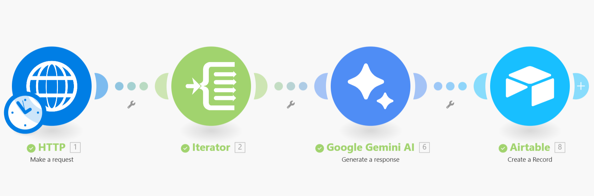

# Reddit-Sentiment-Analysis-Automation.
Automated Sentiment Analysis Pipeline Built an ETL flow using Make.com to fetch real-time Reddit data, analyze user feedback with Google Gemini AI (LLM), and store structured insights in Airtable.

Project Description
The Problem: Manually monitoring thousands of social media posts (such as Reddit) for market research and competitor analysis is incredibly time-consuming, prone to human error, and highly inefficient for scaling businesses.

The Solution: I designed and implemented an Automated AI Data Pipeline that eliminates manual labor. This system autonomously extracts the latest discussions from Reddit, utilizes Google Gemini AI to perform sentiment analysis (categorizing them as Positive, Negative, or Neutral), and saves the structured results directly into an Airtable database.

How it Works (The Pipeline):
Extraction: Fetches real-time data from the Reddit API via HTTP requests.
Transformation: Processes unstructured text through Google Gemini 3 Flash. I applied Advanced Generation Configurations (Temperature: 0.1) to ensure the AI provides highly accurate, consistent, and deterministic results.
Loading: The final analyzed insights are stored in Airtable, providing a clean, organized dashboard for team review.

Business Impact:
Operational Efficiency: Converted hours of manual labor into a near-instant automated process.
Data-Driven Insights: Enables faster, more informed product decisions based on real-time user feedback and sentiment trends.

How to Run This Project
To replicate this automation, follow these steps:
1. Airtable Setup:
- Create a Base with a table containing two columns: Post Content (Long Text) and Sentiment (Single Line Text).
- Generate a Personal Access Token (PAT) in the Airtable Developer Hub.
- Scopes required: data.records:read, data.records:write, and schema.bases:read.
- Access: Grant access to your specific workspace or "All Bases".
2. Make.com Configuration:
- Import the provided .json blueprint file into a new Make.com scenario.
- Connect your Reddit API via the HTTP module to fetch JSON data.
- Link your Google Gemini AI account and use the "Generate a Response" module.
- Prompt used: "Analyze the sentiment of this text and respond with only one word: Positive, Negative, or Neutral."
3. Data Mapping:
- Map the selftext from the Reddit Iterator to the Airtable "Post Content" field.
- Map the Gemini AI text output to the Airtable "Sentiment" field.
4. Execution:
- Click Run Once to test the data flow.
- Verify the results appearing in real-time in your Airtable grid.

